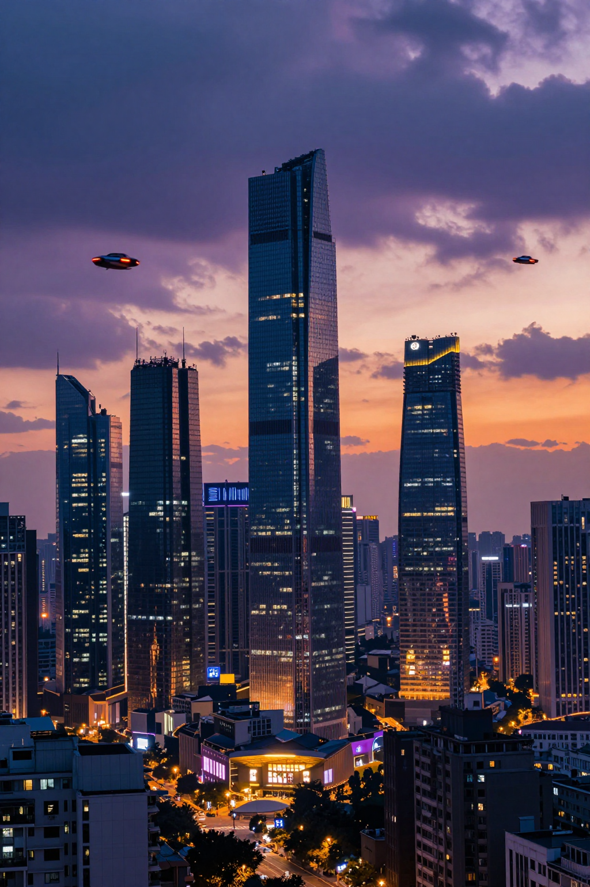
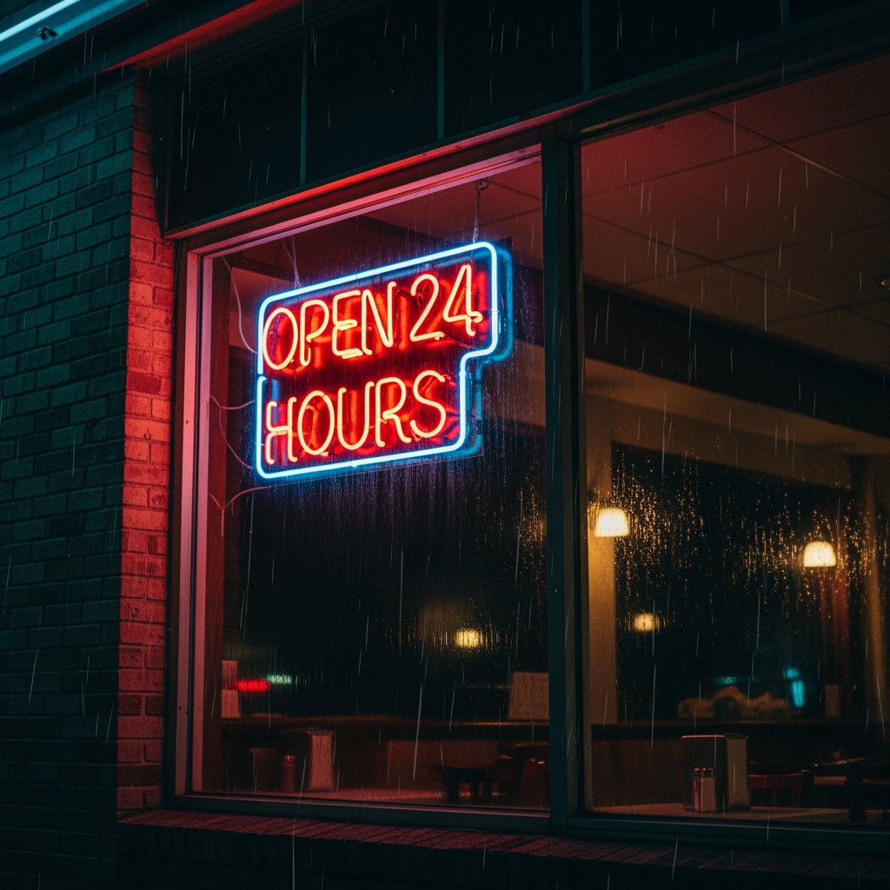

# Best AI Image Generation Models in 2026: Complete Comparison

AI image generation in 2026 has reached a point where the fundamental question has shifted. It is no longer "can AI generate a good image?" -- the answer is yes, across the board. The real question is which model best fits your specific workflow, budget, and quality requirements. A model that excels at photorealistic product photography may be the wrong choice for typography-heavy marketing assets. A model that is the cheapest per image may produce output that requires too much manual revision for your use case.

This guide compares every major AI image generation model available through the Atlas Cloud API. We evaluate each on photorealism, text rendering, speed, pricing, and practical suitability for real production workflows. The goal is to give you enough information to make an architectural decision about which model -- or combination of models -- belongs in your image pipeline.

*Last Updated: February 28, 2026*

Here are examples of what these models can generate:






## The Complete Comparison Table

| Model | Developer | Price/Image | Max Resolution | Speed | Text Rendering | Photorealism | Best For |
|-------|-----------|-------------|---------------|-------|---------------|-------------|----------|
| **Z-Image Turbo** | Z-AI | $0.01 | 1024x1024 | ~1s | Basic | Good | High-volume drafts |
| **Seedream v5.0 Lite** | ByteDance | $0.026 | 2048x2048 | ~2s | Good | Strong | Budget production |
| **Flux 2 Pro** | Black Forest Labs | $0.03-0.05 | 2048x2048 | ~3s | Good | Strong | Speed + versatility |
| **Imagen 4 Standard** | Google DeepMind | $0.04 | 2048x2048 | ~4s | Good | Excellent | Balanced quality |
| **Ideogram v3** | Ideogram | $0.03-0.05 | 2048x2048 | ~4s | Excellent | Good | Typography + design |
| **Nano Banana 2** | Nano Banana | $0.056-0.072 | 2048x2048 | ~5s | Good | Strong | Creative styles |
| **Imagen 4 Ultra** | Google DeepMind | $0.08 | 2048x2048 | ~8s | Good | Best-in-class | Premium photorealism |

All models are accessible through a single Atlas Cloud API key. One account, one billing system, one authentication flow -- swap between models by changing a single parameter.

## Rankings by Category

### Best Photorealism: Imagen 4 Ultra

Imagen 4 Ultra from Google DeepMind produces the most photorealistic output of any publicly available image generation API in 2026. Skin textures, fabric details, water reflections, atmospheric lighting -- all are rendered with a fidelity that other models have not matched. In blind comparison tests, Imagen 4 Ultra outputs are consistently the hardest to distinguish from actual photographs.

The tradeoff is cost ($0.08/image) and speed (~8s). For hero images and premium content where quality justifies the premium, there is no better option. For bulk generation, look elsewhere.

### Best Text Rendering: Ideogram v3

If your images need to contain readable text -- product labels, signage, brand names, posters, social media graphics with overlaid copy -- Ideogram v3 is the clear leader. The model renders text with accuracy and legibility that other models still struggle to consistently achieve.

This is not a marginal advantage. Other models often produce garbled or slightly distorted text, especially with longer strings or unusual fonts. Ideogram v3 handles these cases reliably, making it the default choice for any typography-heavy use case.

### Best Value: Seedream v5.0 Lite

At $0.026/image with 2048x2048 resolution and generation times around 2 seconds, Seedream v5.0 Lite from ByteDance delivers an outstanding quality-to-price ratio. The output quality is competitive with models costing 2-3x more, and the speed is fast enough for real-time workflows.

For teams that need to generate thousands of images per day without breaking the budget, Seedream v5.0 Lite is the practical choice. The quality is not quite at Imagen 4 Ultra's level, but it is good enough for the vast majority of production use cases.

### Best Speed: Z-Image Turbo

Z-Image Turbo generates images in approximately 1 second at $0.01/image. For applications where latency matters -- real-time user-facing generation, rapid iteration during design sessions, or extremely high-volume batch processing -- nothing else comes close.

The tradeoffs are real. Resolution maxes out at 1024x1024, text rendering is basic, and fine detail is below what premium models deliver. But for the right use case, the speed advantage is decisive.

### Best Overall: Flux 2 Pro

Flux 2 Pro from Black Forest Labs occupies the sweet spot across all dimensions. It generates quickly (~3s), produces strong photorealistic output, handles text rendering well enough for most use cases, supports up to 2048x2048 resolution, and is priced competitively at $0.03-0.05/image.

No individual metric is best-in-class, but no metric is a weakness either. For teams that need a single default model that performs well across product photography, marketing assets, social media content, and creative projects, Flux 2 Pro is the safest starting point.

### Best for Creative Styles: Nano Banana 2

Nano Banana 2 excels at artistic and creative image generation. The model handles illustrated, painterly, surreal, and abstract styles with a distinctiveness that more photorealism-focused models lack. If your content strategy leans toward creative, artistic imagery rather than strict photorealism, Nano Banana 2 delivers character and visual interest that other models flatten out.

## Individual Model Breakdowns

### Flux 2 Pro (Black Forest Labs)

Flux 2 Pro is the workhorse model. It does not lead any single category, but it performs competently across all of them. For most teams, this is the model you should evaluate first.

**Pros:**
- Fast generation (~3 seconds at 1024x1024)
- Strong versatility across product photography, illustrations, marketing assets, and social media content
- Good text rendering -- brand names, short captions, and signage are legible in most generations
- Consistent output quality -- repeated generations from similar prompts yield reliably similar results
- 2048x2048 maximum resolution

**Cons:**
- Photorealism falls short of Imagen 4 Ultra on close inspection
- Text rendering is behind Ideogram v3 on complex typography
- Does not have a distinctive style -- outputs can feel generic compared to more opinionated models
- Mid-range pricing is neither the cheapest nor the most expensive

**Best for:** Teams that need a reliable default for diverse content types. E-commerce product imagery, marketing assets, blog illustrations, and rapid prototyping.

### Imagen 4 Ultra (Google DeepMind)

When image quality is the primary criterion and budget is secondary, Imagen 4 Ultra is the answer. Google DeepMind's premium model produces output with photorealistic fidelity that is genuinely difficult to distinguish from professional photography.

**Pros:**
- Best-in-class photorealism -- skin textures, fabric, reflections, and lighting are exceptional
- Accurate color reproduction faithful to prompt descriptions
- Handles complex multi-subject compositions with coherent depth and spatial relationships
- Fine detail preservation at 2048x2048 -- minimal artifacting at high resolution
- Strong performance on architectural, interior, and product visualization

**Cons:**
- $0.08/image is the most expensive option in this comparison
- ~8 second generation time is the slowest -- 2-3x slower than Flux 2 Pro
- Overkill for high-volume, lower-value use cases where the quality premium is wasted
- Text rendering is good but not at Ideogram v3's level

**Best for:** Hero images, editorial content, luxury brand assets, real estate and architectural visualization, and any context where the image is the centerpiece of the presentation.

### Imagen 4 Standard (Google DeepMind)

Imagen 4 Standard is the mid-tier offering in Google's lineup. It provides much of Imagen 4 Ultra's quality at a more accessible price point.

**Pros:**
- Strong photorealism -- noticeably better than most non-Google models
- $0.04/image is competitively priced for the quality level
- ~4 second generation time is reasonable
- 2048x2048 resolution support
- Benefits from the same underlying architecture as Ultra, with optimizations for speed and cost

**Cons:**
- Fine detail is visibly below Ultra in side-by-side comparison
- Does not justify the price premium over Flux 2 Pro for all use cases
- Text rendering is average
- Positioned awkwardly between Flux 2 Pro (faster, cheaper) and Imagen 4 Ultra (better quality)

**Best for:** Teams that want Google-level quality without Ultra pricing. A good middle-ground for production workflows where Flux 2 Pro's quality is not quite sufficient but Ultra's cost is not justifiable.

### Ideogram v3 (Ideogram)

Ideogram v3 is the specialist in text-heavy image generation. If your images need readable, accurate text, this is the model to use.

**Pros:**
- Best text rendering accuracy of any model in this comparison
- Handles long strings, unusual fonts, and complex layouts reliably
- Good overall image quality beyond just text rendering
- $0.03-0.05/image is competitively priced
- Strong performance on design-oriented prompts -- posters, packaging, signage

**Cons:**
- Photorealism is behind Imagen 4 Ultra and Flux 2 Pro
- ~4 second generation time is moderate
- Less versatile outside of its typography strength
- Output can have a slightly "designed" quality that works for marketing but less so for photorealistic use cases

**Best for:** Marketing graphics with text overlays, product packaging mockups, social media posts with embedded copy, signage, and any use case where text accuracy is a requirement.

### Seedream v5.0 Lite (ByteDance)

ByteDance's Seedream v5.0 Lite is the value play. At $0.026/image with fast generation times and 2048x2048 resolution, it delivers production-grade output at a price that enables high-volume workflows.

**Pros:**
- $0.026/image -- among the cheapest options with high resolution support
- Fast generation (~2 seconds)
- 2048x2048 resolution
- Good enough quality for the vast majority of production use cases
- Strong performance on product photography and commercial content

**Cons:**
- Quality gap relative to Imagen 4 Ultra is noticeable on close inspection
- Text rendering is decent but not at Ideogram v3's level
- Less community support and prompt engineering resources compared to Flux or Imagen
- Fine detail in complex scenes can be inconsistent

**Best for:** High-volume production pipelines where cost efficiency is critical. E-commerce catalogs, social media content calendars, and batch generation workflows.

### Nano Banana 2 (Nano Banana)

Nano Banana 2 brings personality to AI image generation. While other models optimize for photorealistic accuracy, Nano Banana 2 excels at creative, artistic, and stylistically distinctive output.

**Pros:**
- Excellent at artistic and creative styles -- illustration, painterly, surreal, abstract
- Outputs have visual character and distinctiveness that other models lack
- Good prompt adherence for creative descriptions
- 2048x2048 resolution support

**Cons:**
- $0.056-0.072/image is above the mid-range
- ~5 second generation time is moderate
- Photorealism is not its strength
- Less suitable for commercial and corporate use cases that demand clean, professional output
- Smaller community means fewer prompt guides and best practices available

**Best for:** Creative projects, artistic content, editorial illustrations, and any use case where visual distinctiveness matters more than photorealistic accuracy.

### Z-Image Turbo (Z-AI)

Z-Image Turbo is purpose-built for speed and volume. At $0.01/image and approximately 1-second generation times, it is the fastest and cheapest option available.

**Pros:**
- $0.01/image -- the cheapest option by a significant margin
- ~1 second generation time -- near-instant results
- Good enough quality for drafts, thumbnails, and initial concepts
- Minimal latency makes it suitable for real-time applications

**Cons:**
- 1024x1024 maximum resolution -- lowest in this comparison
- Text rendering is basic and unreliable
- Fine detail and photorealism are noticeably below premium models
- Limited style range compared to more capable models

**Best for:** Rapid prototyping, concept exploration, thumbnail generation, real-time user-facing generation, and extremely high-volume batch processing where cost is the primary constraint.

## How to Access All Models Through Atlas Cloud

### Step 1: Create Your API Key

Sign up at [Atlas Cloud](https://www.atlascloud.ai?utm_medium=article&utm_source=blog&utm_campaign=best-ai-image-generation-models-2026) and generate an API key from the console. New accounts receive a $1 free credit to test any model.


### Step 2: Generate an Image

Here is a Python example using Flux 2 Pro. Change the model ID to switch between any model in this guide.

```python
import requests
import time

API_KEY = "your_api_key_here"
BASE_URL = "https://api.atlascloud.ai/api/v1"

# Submit generation request
response = requests.post(
    f"{BASE_URL}/model/prediction",
    headers={"Authorization": f"Bearer {API_KEY}"},
    json={
        "model": "black-forest-labs/flux-2-pro/text-to-image",
        "input": {
            "prompt": "Professional product photo of wireless earbuds on a marble surface, studio lighting, clean white background",
            "width": 1024,
            "height": 1024
        }
    }
)
request_id = response.json()["request_id"]

# Poll for results
while True:
    result = requests.get(
        f"{BASE_URL}/model/prediction/{request_id}/get",
        headers={"Authorization": f"Bearer {API_KEY}"}
    )
    data = result.json()
    if data["status"] == "completed":
        print(f"Image URL: {data['output']['image_url']}")
        break
    elif data["status"] == "failed":
        print(f"Error: {data['error']}")
        break
    time.sleep(2)
```

Model IDs for other models:
- Imagen 4 Ultra: `"google/imagen4-ultra/text-to-image"`
- Ideogram v3: `"ideogram/ideogram-v3/text-to-image"`
- Seedream v5.0 Lite: `"bytedance/seedream-v5.0-lite"`
- Z-Image Turbo: `"z-ai/z-image-turbo/text-to-image"`
- Nano Banana 2: `"nano-banana/nano-banana-2/text-to-image"`

### Step 3: Compare Models Side by Side

Run the same prompt across multiple models to see how they differ. This is the most effective way to decide which model fits your use case.

```python
models = [
    "black-forest-labs/flux-2-pro/text-to-image",
    "google/imagen4-ultra/text-to-image",
    "ideogram/ideogram-v3/text-to-image",
    "bytedance/seedream-v5.0-lite"
]

prompt = "A vintage coffee shop interior, warm afternoon light, bokeh effect, photorealistic"

request_ids = {}
for model in models:
    response = requests.post(
        f"{BASE_URL}/model/prediction",
        headers={"Authorization": f"Bearer {API_KEY}"},
        json={
            "model": model,
            "input": {"prompt": prompt, "width": 1024, "height": 1024}
        }
    )
    request_ids[model] = response.json()["request_id"]
    print(f"Submitted {model}: {request_ids[model]}")
```

## Decision Framework

**Need one model for everything?** Flux 2 Pro. It is the most versatile and handles the widest range of content types competently.

**Need the highest quality possible?** Imagen 4 Ultra. Nothing else matches its photorealistic output.

**Need text in your images?** Ideogram v3. It is the only model that reliably renders complex text.

**Need to minimize cost?** Z-Image Turbo at $0.01/image for drafts, Seedream v5.0 Lite at $0.026/image for production quality.

**Need creative and artistic styles?** Nano Banana 2. Its strength is visual character and stylistic range.

**Need maximum speed?** Z-Image Turbo generates in approximately 1 second. Seedream v5.0 Lite at ~2 seconds is the fastest option with high resolution.

**Not sure?** Start with Flux 2 Pro. It is the safest default, and you can always specialize later once you have identified your specific needs.

## Frequently Asked Questions

### Which AI image generation model produces the most realistic photos?

Imagen 4 Ultra from Google DeepMind produces the most photorealistic output available in 2026. Skin textures, fabric details, lighting, and reflections are rendered with fidelity that is consistently the hardest to distinguish from real photographs. The tradeoff is cost ($0.08/image) and speed (~8s).

### Can AI image generators render text accurately?

Most models still struggle with text rendering, but Ideogram v3 is the clear exception. It reliably produces legible, accurate text in images -- including long strings, brand names, and complex layouts. If your images need readable text, Ideogram v3 is the recommended choice.

### What is the cheapest AI image generation API?

Z-Image Turbo at $0.01/image is the cheapest option, generating images in approximately 1 second at 1024x1024 resolution. For production-quality output at 2048x2048, Seedream v5.0 Lite at $0.026/image offers the best value.

### Can I access all image generation models through one API?

Yes. Atlas Cloud provides access to Flux 2 Pro, Imagen 4 Ultra, Ideogram v3, Seedream v5.0 Lite, Z-Image Turbo, and Nano Banana 2 through a single API key with unified billing. You switch between models by changing the model ID in your request.

## Final Verdict

The AI image generation market in 2026 has matured to the point where there are no bad options -- only options better or worse suited to specific needs. Every model in this comparison produces usable output for at least some production use case.

**Flux 2 Pro** remains the best default for most teams. Its combination of speed, quality, versatility, and competitive pricing makes it the model you should evaluate first.

**Imagen 4 Ultra** is the quality ceiling. When the image is the product -- hero shots, editorial features, premium brand assets -- the cost premium is justified.

**Ideogram v3** owns the typography niche. If text rendering matters to your workflow, there is no real alternative.

**Seedream v5.0 Lite** is the volume play. For high-throughput pipelines where per-image cost matters, it delivers the best ratio of quality to price.

The practical advantage of using Atlas Cloud is flexibility. You can use Flux 2 Pro as your default, switch to Imagen 4 Ultra for hero content, route typography-heavy requests to Ideogram v3, and fall back to Z-Image Turbo for rapid prototyping -- all through the same API, same key, same billing.

> [Start generating images with all models -- $1 free credit](https://www.atlascloud.ai?utm_medium=article&utm_source=blog&utm_campaign=best-ai-image-generation-models-2026)

## Related Articles

- [Atlas Cloud Image Generation: Flux, Imagen & Ideogram API Guide](https://www.atlascloud.ai/blog/image-generation-api-guide?utm_medium=article&utm_source=blog&utm_campaign=best-ai-image-generation-models-2026)
- [Cheapest AI Image Generation APIs in 2026](https://www.atlascloud.ai/blog/cheapest-ai-image-generation-api-2026?utm_medium=article&utm_source=blog&utm_campaign=best-ai-image-generation-models-2026)
- [Best AI Video Generation Models in 2026](https://www.atlascloud.ai/blog/best-ai-video-generation-models-2026?utm_medium=article&utm_source=blog&utm_campaign=best-ai-image-generation-models-2026)
- [How to Generate AI Product Photography](https://www.atlascloud.ai/blog/how-to-generate-ai-product-photography?utm_medium=article&utm_source=blog&utm_campaign=best-ai-image-generation-models-2026)
- [Seedance 2.0 Pricing: Full Cost Breakdown](https://www.atlascloud.ai/blog/seedance-2-0-pricing-breakdown?utm_medium=article&utm_source=blog&utm_campaign=best-ai-image-generation-models-2026)
