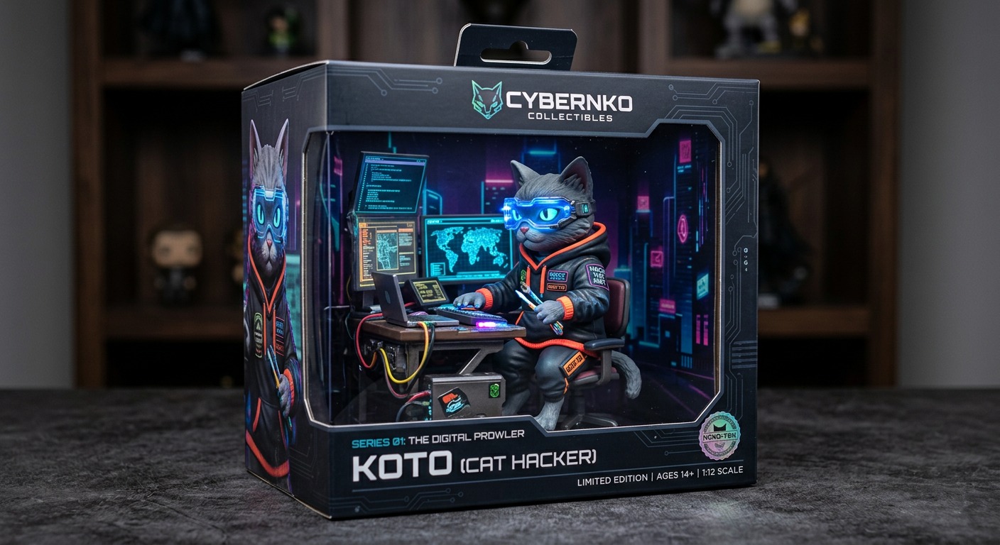

# How to Generate AI Product Photography with Atlas Cloud

Product photography has always been one of the most expensive and time-consuming parts of running an e-commerce business. A single product shoot can cost anywhere from $500 to $5,000 depending on the complexity, the photographer, and the number of SKUs involved. Multiply that across seasonal campaigns, new product launches, and A/B testing variants, and photography becomes a serious line item. AI product photography changes this equation entirely.

With the right AI image generation models and a well-structured workflow, teams can produce studio-quality product images in seconds rather than days, at a fraction of the cost. This guide walks through everything you need to generate professional AI product photography using the Atlas Cloud API -- from model selection and prompt engineering to batch automation and common pitfalls.

*Last Updated: February 28, 2026*

Here are examples of AI-generated product photography:




## Why AI Product Photography Makes Sense in 2026

The case for AI-generated product images is no longer theoretical. E-commerce brands are already using AI product photography in production for catalog images, social media assets, and advertising creatives. The reasons are straightforward:

- **Speed**: Generate hundreds of product images per hour instead of scheduling multi-day shoots.
- **Cost**: A single AI-generated image costs $0.03 to $0.08. A traditional product photo costs $25 to $150 per shot when factoring in studio time, equipment, and editing.
- **Consistency**: Every image follows the same lighting, angle, and style guidelines without variation from shoot to shoot.
- **Iteration**: Test different backgrounds, lighting setups, and compositions without reshooting.
- **Scale**: Generate images for thousands of SKUs without proportionally scaling your photography budget.

The technology has reached the point where AI-generated product photos are indistinguishable from traditional photography for most e-commerce use cases. The remaining question is which models to use and how to prompt them effectively.

## Best Models for AI Product Photography

Atlas Cloud provides access to 300+ AI models through a single API key. For product photography specifically, three models stand out, each with distinct strengths.

### Flux 2 Pro -- The Photorealism Workhorse

| Spec | Detail |
|------|--------|
| **Developer** | Black Forest Labs |
| **Model ID** | `black-forest-labs/flux-2-pro/text-to-image` |
| **Max Resolution** | 2048x2048 |
| **Speed** | ~3 seconds |
| **Price** | $0.03-0.05/image |
| **Best For** | Clean product shots, white backgrounds, studio lighting |

Flux 2 Pro is the default choice for high-volume product photography. It generates images fast, handles studio lighting scenarios reliably, and produces clean compositions with accurate color rendering. When you need 500 product photos with white backgrounds and consistent lighting, Flux 2 Pro delivers without surprises.

Its speed advantage compounds at scale. At 3 seconds per generation, a batch of 1,000 images completes in under an hour. At $0.03 to $0.05 per image, that same batch costs $30 to $50 -- roughly what a single traditional product photo costs.

### Imagen 4 Ultra -- Premium Quality

| Spec | Detail |
|------|--------|
| **Developer** | Google DeepMind |
| **Model ID** | `google/imagen4-ultra/text-to-image` |
| **Max Resolution** | 2048x2048 |
| **Speed** | ~8 seconds |
| **Price** | $0.04-0.08/image |
| **Best For** | Hero images, luxury products, lifestyle scenes |

Imagen 4 Ultra produces the most photorealistic output of any publicly available image generation API. Material textures -- leather grain, metal brushing, glass reflections -- are rendered with exceptional fidelity. For hero images on landing pages, premium brand photography, and any context where the image will be viewed at full size and scrutinized, Imagen 4 Ultra justifies its slightly higher cost and slower generation time.

The model also excels at text rendering within images. If your product packaging includes brand names, labels, or ingredient lists that need to appear legible in the generated image, Imagen 4 Ultra handles this with good accuracy.

### Nano Banana 2 -- 3D Product Visualization

| Spec | Detail |
|------|--------|
| **Developer** | Nano Banana |
| **Model ID** | `nano-banana/nano-banana-2/text-to-image` |
| **Max Resolution** | 2048x2048 |
| **Speed** | ~5 seconds |
| **Price** | $0.03-0.06/image |
| **Best For** | 3D-style product renders, isometric views, product exploded views |

Nano Banana 2 brings a unique capability to product photography -- 3D-style rendering that produces images resembling professional 3D product visualizations. This is particularly valuable for electronics, gadgets, and any product where showing internal components, multiple angles, or exploded views adds value.

The model understands concepts like isometric perspective, product cutaway views, and floating component arrangements. For tech products, appliances, and items where engineering details are selling points, Nano Banana 2 creates imagery that would traditionally require a 3D modeling team.

## How to Access the Atlas Cloud Image Generation API

### Step 1: Get Your API Key

Sign up at [Atlas Cloud](https://www.atlascloud.ai?utm_medium=article&utm_source=blog&utm_campaign=how-to-generate-ai-product-photography) and create an API key from the dashboard. You receive $1 in free credit automatically -- enough for 20-30 product photos to test the workflow before committing to production volume.


### Step 2: Generate Your First Product Photo

```python
import requests
import time

API_KEY = "your-atlas-cloud-api-key"
BASE_URL = "https://api.atlascloud.ai/api/v1"

# Generate a product photo with Flux 2 Pro
response = requests.post(
    f"{BASE_URL}/model/generateImage",
    headers={
        "Authorization": f"Bearer {API_KEY}",
        "Content-Type": "application/json"
    },
    json={
        "model": "black-forest-labs/flux-2-pro/text-to-image",
        "prompt": "Professional product photo of a minimalist ceramic coffee mug, pure white background, soft studio lighting from upper left, subtle shadow beneath, commercial photography style, 8K detail",
        "width": 1024,
        "height": 1024
    }
)

result = response.json()

# Poll for the completed image
while True:
    status = requests.get(
        f"{BASE_URL}/model/prediction/{result['request_id']}/get",
        headers={"Authorization": f"Bearer {API_KEY}"}
    ).json()
    if status["status"] == "completed":
        print(f"Image URL: {status['output']['image_url']}")
        break
    time.sleep(3)
```

**Step 3:** The API returns a `request_id` immediately. Poll the prediction endpoint until the status is `completed`, then retrieve the image URL from the response. For Flux 2 Pro, generation typically completes in 3 to 5 seconds.

> [Start Generating Product Photos -- $1 Free Credit](https://www.atlascloud.ai?utm_medium=article&utm_source=blog&utm_campaign=how-to-generate-ai-product-photography)

## Prompt Templates by Product Category

The difference between a mediocre AI product photo and a professional one comes down to the prompt. Below are tested prompt templates organized by product category. Each template includes the key elements that produce consistent, high-quality results.

### Cosmetics and Beauty

```
Professional product photography of [PRODUCT], placed on [SURFACE],
[LIGHTING] lighting, [BACKGROUND]. Soft bokeh background with
[ACCENT ELEMENTS]. Beauty editorial style, high-end magazine quality,
sharp focus on product, 8K resolution.
```

**Example:**
```
Professional product photography of a rose gold lipstick tube with
cap removed showing deep red shade, placed on a polished marble
surface, warm golden hour lighting, cream-colored gradient background.
Soft bokeh background with scattered rose petals. Beauty editorial
style, high-end magazine quality, sharp focus on product, 8K resolution.
```

**Key elements for cosmetics:** Specify the exact shade/color of the product. Include surface texture (marble, glass, silk). Use warm lighting descriptors. Mention editorial or magazine style to trigger high-end composition.

### Electronics and Tech

```
Commercial product photo of [PRODUCT], [ANGLE] view, [BACKGROUND],
[LIGHTING]. Clean minimalist composition, [DETAIL FOCUS]. Technology
product photography, sharp detail rendering, professional studio setup.
```

**Example:**
```
Commercial product photo of wireless noise-canceling headphones in
matte black finish, three-quarter angle view, pure white seamless
background, dramatic side lighting with subtle rim light. Clean
minimalist composition, visible texture on ear cushion leather and
brushed aluminum headband. Technology product photography, sharp
detail rendering, professional studio setup.
```

**Key elements for electronics:** Specify material finishes (matte, glossy, brushed). Use dramatic or directional lighting to highlight form. Include detail about specific textures and materials. Maintain clean, minimal backgrounds.

### Fashion and Apparel

```
Fashion product photography of [ITEM] in [COLOR/PATTERN], [DISPLAY METHOD],
[BACKGROUND], [LIGHTING]. [FABRIC DETAIL]. Commercial catalog style,
true-to-life colors, professional fashion photography.
```

**Example:**
```
Fashion product photography of a tailored navy blue wool blazer,
displayed on an invisible mannequin showing natural drape and structure,
light gray seamless background, soft diffused studio lighting from
both sides. Visible wool texture and stitching detail on lapel.
Commercial catalog style, true-to-life colors, professional fashion
photography.
```

**Key elements for fashion:** Specify how the garment is displayed (flat lay, mannequin, hanger). Describe fabric texture explicitly. Use "true-to-life colors" to prevent AI color drift. Include construction details (stitching, seams, buttons).

### Food and Beverage

```
Food photography of [ITEM], [PLATING/PRESENTATION], [SURFACE],
[LIGHTING]. [GARNISH/STYLING]. Appetizing commercial food photography,
[MOOD], shallow depth of field, 8K detail.
```

**Example:**
```
Food photography of artisan sourdough bread loaf with golden crust
and visible scoring pattern, sliced to reveal open crumb structure,
placed on a rustic wooden cutting board with linen cloth beneath,
warm natural window lighting from the left. Scattered flour dusting
and wheat stalks as props. Appetizing commercial food photography,
warm and inviting mood, shallow depth of field, 8K detail.
```

**Key elements for food:** Always specify lighting direction (side or back lighting works best). Include surface and prop details. Use "appetizing" as a style modifier. Describe textures (crispy, glazed, frosted, steaming).

### Jewelry

```
Jewelry product photography of [PIECE] in [METAL/MATERIAL], [DISPLAY],
[BACKGROUND], [LIGHTING]. [DETAIL FOCUS]. Luxury jewelry commercial,
precise detail on [SPECIFIC ELEMENTS], high-end advertising quality.
```

**Example:**
```
Jewelry product photography of a solitaire diamond engagement ring
in platinum setting, displayed on a black velvet ring cushion,
dark gradient background transitioning from charcoal to black,
precise spot lighting creating brilliant diamond refraction and
metal highlights. Extreme close-up detail showing diamond facets
and prong setting. Luxury jewelry commercial, precise detail on
stone clarity and metal polish, high-end advertising quality.
```

**Key elements for jewelry:** Use dark backgrounds for contrast and luxury feel. Specify lighting that creates reflections and refractions. Include material details (platinum, gold, sterling silver). Request extreme detail on stone and setting.

## Complete Batch Generation Script

For production use, you need a script that handles multiple products, multiple models, error recovery, and organized output. The following Python script provides a complete batch generation system.

```python
import requests
import time
import json
import os
from concurrent.futures import ThreadPoolExecutor, as_completed
from dataclasses import dataclass
from typing import Optional

API_KEY = "your-atlas-cloud-api-key"
BASE_URL = "https://api.atlascloud.ai/api/v1"
OUTPUT_DIR = "product_photos"

@dataclass
class ProductShot:
    name: str
    prompt: str
    model: str = "black-forest-labs/flux-2-pro/text-to-image"
    width: int = 1024
    height: int = 1024

def generate_image(shot: ProductShot) -> dict:
    """Submit an image generation request."""
    response = requests.post(
        f"{BASE_URL}/model/generateImage",
        headers={
            "Authorization": f"Bearer {API_KEY}",
            "Content-Type": "application/json"
        },
        json={
            "model": shot.model,
            "prompt": shot.prompt,
            "width": shot.width,
            "height": shot.height
        }
    )
    response.raise_for_status()
    return response.json()

def poll_result(request_id: str, max_wait: int = 120) -> Optional[str]:
    """Poll for image completion. Returns image URL or None."""
    start_time = time.time()
    while time.time() - start_time < max_wait:
        response = requests.get(
            f"{BASE_URL}/model/prediction/{request_id}/get",
            headers={"Authorization": f"Bearer {API_KEY}"}
        )
        data = response.json()
        if data["status"] == "completed":
            return data["output"]["image_url"]
        elif data["status"] == "failed":
            print(f"  Generation failed for {request_id}: {data.get('error', 'Unknown')}")
            return None
        time.sleep(3)
    print(f"  Timeout waiting for {request_id}")
    return None

def download_image(url: str, filepath: str):
    """Download the generated image to disk."""
    response = requests.get(url)
    response.raise_for_status()
    with open(filepath, "wb") as f:
        f.write(response.content)

def process_shot(shot: ProductShot) -> dict:
    """Generate, poll, and download a single product shot."""
    print(f"Generating: {shot.name}")
    try:
        result = generate_image(shot)
        request_id = result["request_id"]
        image_url = poll_result(request_id)
        if image_url:
            filename = f"{shot.name.replace(' ', '_').lower()}.png"
            filepath = os.path.join(OUTPUT_DIR, filename)
            download_image(image_url, filepath)
            print(f"  Saved: {filepath}")
            return {"name": shot.name, "status": "success", "file": filepath}
        return {"name": shot.name, "status": "failed", "file": None}
    except Exception as e:
        print(f"  Error: {e}")
        return {"name": shot.name, "status": "error", "file": None}

def batch_generate(shots: list[ProductShot], max_workers: int = 5):
    """Process multiple product shots concurrently."""
    os.makedirs(OUTPUT_DIR, exist_ok=True)
    results = []
    with ThreadPoolExecutor(max_workers=max_workers) as executor:
        futures = {executor.submit(process_shot, shot): shot for shot in shots}
        for future in as_completed(futures):
            results.append(future.result())

    # Summary
    success = sum(1 for r in results if r["status"] == "success")
    failed = sum(1 for r in results if r["status"] != "success")
    print(f"\nBatch complete: {success} succeeded, {failed} failed")
    return results


# Define your product shots
products = [
    ProductShot(
        name="Coffee Mug White BG",
        prompt="Professional product photo of a minimalist white ceramic "
               "coffee mug, pure white seamless background, soft studio "
               "lighting from upper left, subtle shadow, commercial style, 8K"
    ),
    ProductShot(
        name="Coffee Mug Lifestyle",
        prompt="Lifestyle product photo of a white ceramic coffee mug filled "
               "with latte art, placed on a wooden cafe table, morning sunlight "
               "through window, warm tones, shallow depth of field, editorial",
        model="google/imagen4-ultra/text-to-image"
    ),
    ProductShot(
        name="Headphones Hero",
        prompt="Commercial product photo of premium wireless headphones in "
               "matte black, floating at slight angle, dark gradient background, "
               "dramatic rim lighting, technology product photography, 8K detail",
        model="google/imagen4-ultra/text-to-image"
    ),
    ProductShot(
        name="Headphones 3D Exploded",
        prompt="3D product visualization of wireless headphones with exploded "
               "view showing internal components, drivers, cushions, and frame "
               "separated and floating, isometric perspective, clean white "
               "background, technical product render style",
        model="nano-banana/nano-banana-2/text-to-image"
    ),
    ProductShot(
        name="Lipstick Beauty",
        prompt="Beauty product photography of luxury red lipstick tube with "
               "cap removed, placed on polished marble surface, warm golden "
               "lighting, cream gradient background, scattered rose petals, "
               "high-end magazine editorial quality, 8K resolution"
    ),
]

if __name__ == "__main__":
    results = batch_generate(products, max_workers=3)
    # Save results manifest
    with open(os.path.join(OUTPUT_DIR, "manifest.json"), "w") as f:
        json.dump(results, f, indent=2)
```

This script handles concurrent generation, automatic polling, file downloads, and produces a manifest file tracking all results. Adjust `max_workers` based on your Atlas Cloud rate limits -- 3 to 5 concurrent requests is a safe starting point.

## Background Generation and Scene Placement Tips

One of the most powerful techniques in AI product photography is controlling the background and scene context. The same product photographed against different backgrounds serves completely different marketing purposes.

### White Background (E-commerce Standard)

Use phrases like "pure white seamless background," "white cyclorama studio," or "white infinity cove." Add "no shadows" for completely clean cutouts, or "subtle contact shadow" for grounded placement that still looks professional on white.

### Lifestyle Scenes

Describe the environment in detail. Instead of "kitchen background," use "modern Scandinavian kitchen with light oak countertops, brushed brass fixtures, morning light through frosted glass window." The more specific the scene description, the more believable the placement.

### Seasonal and Campaign Backgrounds

AI generation makes seasonal variants trivial. Generate the same product against "autumn foliage backdrop with warm amber lighting," "snowy winter scene with soft blue tones," or "tropical beach setting with turquoise water." What would require separate photo shoots becomes a prompt change.

### Color Coordination

Match backgrounds to brand palettes by specifying exact tones. "Background in hex #F5E6D3 warm beige" or "background matching Pantone Classic Blue" gives the model enough direction to produce on-brand imagery consistently.

### Surface and Prop Selection

Surfaces anchor products in reality. Common effective combinations:

- **Cosmetics**: Marble, glass, silk fabric, rose gold trays
- **Electronics**: Concrete, slate, dark wood, brushed metal
- **Food**: Rustic wood, linen, ceramic plates, natural stone
- **Jewelry**: Velvet, satin, mirror surfaces, dark leather
- **Fashion**: Neutral linen, weathered wood, minimalist hangers

## AI Product Photography vs Traditional Photography

| Factor | Traditional Photography | AI Product Photography |
|--------|------------------------|----------------------|
| **Cost per image** | $25-150 | $0.03-0.08 |
| **Setup time** | 2-8 hours per shoot | 0 (prompt-based) |
| **Turnaround** | 1-5 business days | Seconds to minutes |
| **Consistency** | Varies between shoots | Identical parameters every time |
| **Scaling to 1000 SKUs** | $25,000-150,000 | $30-80 |
| **Background variants** | Separate shoot per background | Prompt change |
| **Seasonal campaigns** | New shoot each season | New prompts, same API call |
| **Physical product required** | Yes | No (generate from description) |
| **Complex lighting setups** | Hours of adjustment | Described in prompt |
| **Human models** | Additional cost + scheduling | Not supported for product-on-model |
| **Post-processing** | Required (retouching, color) | Minimal to none |

### Where Traditional Photography Still Wins

AI product photography is not a universal replacement. Traditional photography remains superior in specific scenarios:

- **Products on human models**: Fashion items worn by real people, cosmetics applied to skin, and accessories styled on bodies still require traditional photography. AI models can generate people, but the uncanny valley remains a risk for close-up commercial use.
- **Exact color matching for print**: When colors must match physical samples precisely for print catalogs, traditional photography with calibrated monitors and proofing processes remains more reliable.
- **Complex multi-product compositions**: Arranging 20 products in a single frame with specific spatial relationships is easier to direct with a stylist than with a prompt.
- **Regulatory compliance**: Some industries (pharmaceuticals, food labeling) may require that product images depict the actual product rather than a generated representation.

### Where AI Photography Dominates

- **Catalog scale**: Any business with hundreds or thousands of SKUs benefits enormously from AI generation.
- **Rapid iteration**: A/B testing different backgrounds, angles, and compositions for advertising creatives.
- **Pre-production visualization**: Generating product images before the physical product exists, useful for crowdfunding campaigns and pre-orders.
- **International variants**: Generating the same product with different regional packaging or localized text overlays.

## Common Mistakes and How to Fix Them

### Mistake 1: Vague Prompts

**Problem:** "Photo of a shoe" produces generic, unusable output.

**Fix:** Be specific about every element. "Professional product photo of a men's brown leather oxford dress shoe, three-quarter angle from front-left, pure white background, soft diffused studio lighting, visible leather grain texture and stitching detail, commercial catalog photography, 8K resolution."

### Mistake 2: Ignoring Lighting Direction

**Problem:** Flat, uninteresting lighting that makes products look like clip art.

**Fix:** Always specify lighting direction and type. "Key light from upper left at 45 degrees, fill light from right, subtle rim light from behind" creates depth and dimension. Use "dramatic side lighting" for electronics and "soft diffused lighting" for cosmetics.

### Mistake 3: Wrong Model for the Job

**Problem:** Using Flux 2 Pro for hero images where photorealism matters most, or Imagen 4 Ultra for bulk catalog shots where speed matters more.

**Fix:** Match the model to the use case. Flux 2 Pro for volume. Imagen 4 Ultra for premium. Nano Banana 2 for 3D visualization. Using the batch script above, you can assign different models to different product types within the same run.

### Mistake 4: Inconsistent Aspect Ratios

**Problem:** Mixing 1:1, 4:3, and 16:9 images across a product catalog creates a disjointed browsing experience.

**Fix:** Standardize dimensions before generating. E-commerce platforms typically use square (1024x1024) for product listings. Set width and height consistently in your API calls and enforce this in your batch configuration.

### Mistake 5: Over-Prompting

**Problem:** Stuffing prompts with 20 different style modifiers produces confused, muddy output.

**Fix:** Keep prompts focused. A product photography prompt needs five elements: subject description, background, lighting, angle/composition, and style reference. Everything else is noise. "Professional product photo of [subject], [background], [lighting], [composition], [style], 8K resolution" is the template.

### Mistake 6: No Post-Processing Pipeline

**Problem:** Using AI-generated images directly without any quality checks or adjustments.

**Fix:** Even AI-generated images benefit from basic post-processing. Implement a review step in your pipeline that checks for common artifacts, verifies color accuracy against brand guidelines, and applies consistent cropping. Automate where possible, but maintain a human review for hero images.

## Cost Estimation for Product Photography at Scale

| Volume | Model | Cost per Image | Total Cost | Time (Concurrent) |
|--------|-------|---------------|------------|-------------------|
| 100 images | Flux 2 Pro | $0.04 | $4.00 | ~5 min |
| 100 images | Imagen 4 Ultra | $0.06 | $6.00 | ~15 min |
| 500 images | Flux 2 Pro | $0.04 | $20.00 | ~20 min |
| 500 images | Imagen 4 Ultra | $0.06 | $30.00 | ~60 min |
| 1,000 images | Flux 2 Pro | $0.04 | $40.00 | ~40 min |
| 5,000 images | Flux 2 Pro | $0.04 | $200.00 | ~3 hours |

These estimates assume 3-5 concurrent API requests. Actual costs vary slightly based on resolution and prompt complexity. Compare this to traditional photography at $25-150 per image and the economics become clear -- 1,000 traditional product photos would cost $25,000 to $150,000.

> [Generate Product Photos at Scale -- $1 Free Credit](https://www.atlascloud.ai?utm_medium=article&utm_source=blog&utm_campaign=how-to-generate-ai-product-photography)

## Frequently Asked Questions

### Which model should I use for product photography?

For most e-commerce product photos, start with Flux 2 Pro. It offers the best balance of speed, cost, and quality for catalog-scale generation. Use Imagen 4 Ultra for hero images and premium brand photography where maximum photorealism matters. Use Nano Banana 2 when you need 3D-style product renders or exploded views.

### Can I generate product photos without having the physical product?

Yes. AI image generation works entirely from text descriptions. This makes it useful for pre-production visualization, crowdfunding campaigns, and generating images for products still in development. Describe the product in detail -- materials, colors, dimensions, design features -- and the model generates a corresponding image.

### How do I maintain consistency across a product line?

Use a consistent prompt template with fixed elements (background, lighting, angle, style) and only vary the product description. The batch script above demonstrates this pattern. Store your templates as configuration and enforce consistency programmatically rather than relying on manual prompt writing.

### Are AI-generated product photos legal to use commercially?

Images generated through Atlas Cloud's API are available for commercial use. However, avoid generating images that closely replicate trademarked designs, copyrighted artwork, or identifiable real people. When generating products with brand names or logos, use your own brand assets rather than generating competitors' branding.

### What resolution should I generate at?

For e-commerce listings, 1024x1024 is standard and sufficient. For hero images, landing pages, or print materials, generate at 2048x2048. Higher resolutions cost slightly more but provide flexibility for cropping and multi-format use.

## Verdict

AI product photography has crossed the threshold from experimental to production-ready. For e-commerce teams generating catalog imagery at scale, the combination of Flux 2 Pro for volume, Imagen 4 Ultra for premium shots, and Nano Banana 2 for 3D visualization covers virtually every product photography need. The batch generation script in this guide provides a working foundation -- customize the prompt templates for your product categories, set your preferred models, and start generating.

The ROI calculation is simple. If you spend more than $200 per month on product photography, AI generation through Atlas Cloud will reduce that cost by 90% or more while delivering faster turnaround and greater consistency. Start with the $1 free credit, test the quality against your current photography, and scale from there.

> [Start AI Product Photography on Atlas Cloud -- $1 Free Credit](https://www.atlascloud.ai?utm_medium=article&utm_source=blog&utm_campaign=how-to-generate-ai-product-photography)

---
## Related Articles

- [Atlas Cloud Image Generation: Flux, Imagen & Ideogram API Guide](https://www.atlascloud.ai/blog/image-generation-api-guide?utm_medium=article&utm_source=blog&utm_campaign=how-to-generate-ai-product-photography)
- [How to Build an AI Video Pipeline with Python and Atlas Cloud](https://www.atlascloud.ai/blog/how-to-build-ai-video-pipeline-python?utm_medium=article&utm_source=blog&utm_campaign=how-to-generate-ai-product-photography)
- [How to Generate 100+ AI Videos Per Week with Atlas Cloud](https://www.atlascloud.ai/blog/generate-100-videos-week-atlas-cloud?utm_medium=article&utm_source=blog&utm_campaign=how-to-generate-ai-product-photography)
- [Nano Banana 2 API Guide](https://www.atlascloud.ai/blog/nano-banana-2-api-guide?utm_medium=article&utm_source=blog&utm_campaign=how-to-generate-ai-product-photography)
- [Seedream v5 Lite API Guide](https://www.atlascloud.ai/blog/seedream-v5-lite-api-guide?utm_medium=article&utm_source=blog&utm_campaign=how-to-generate-ai-product-photography)
