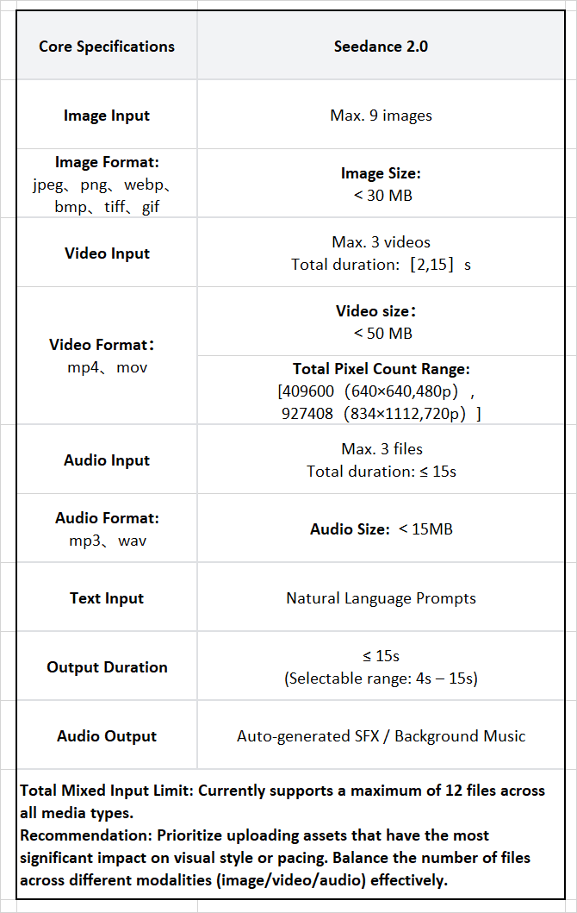
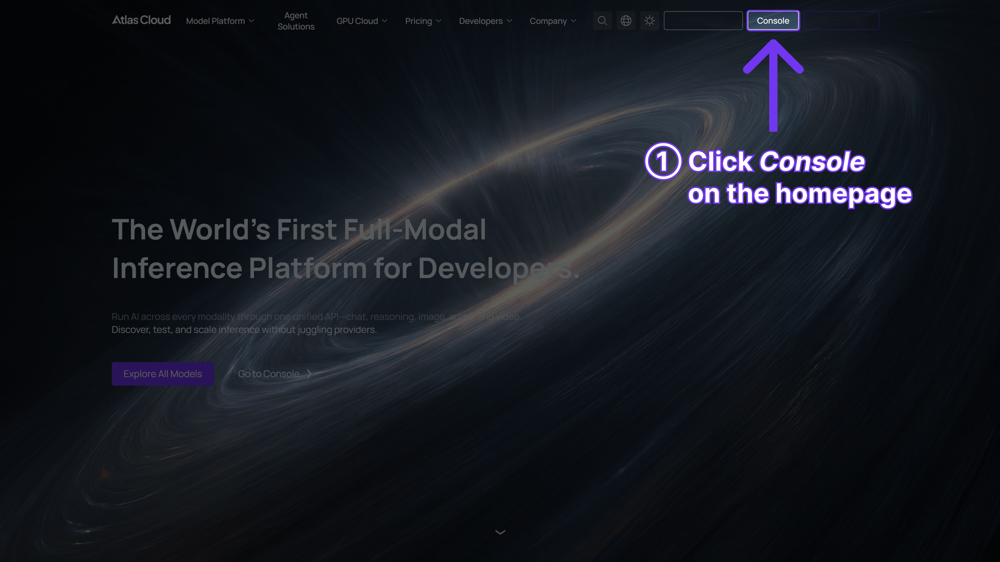
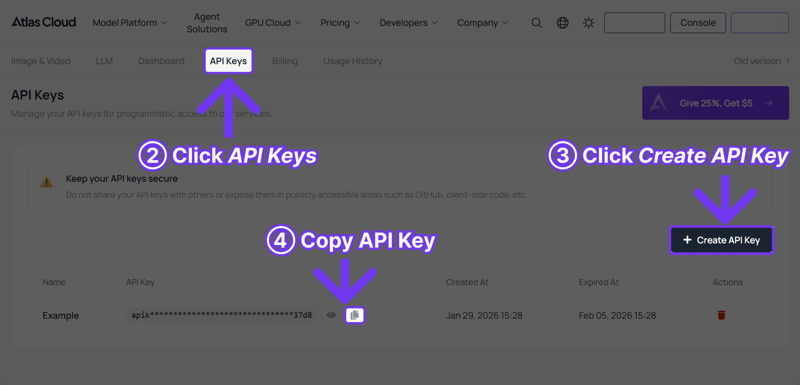

---
title: "How to Use Seedance 2.0 for Video Generation"
description: "Step-by-step guide to generating AI videos with Seedance 2.0. Includes working prompts, API examples, and tips for best results."
keywords: ["Seedance 2.0 how to use", "Seedance 2.0 video generation", "Seedance 2.0 tutorial", "Seedance 2.0 prompt", "Seedance 2.0 guide"]
slug: "how-to-use-seedance-2-0-video-generation"
date: "2026-02-20"
author: "Atlas Cloud Team"
---# How to Use Seedance 2.0 for Video Generation (Prompts Included)

ByteDance's Seedance 2.0 represents a significant leap forward in AI video generation. Across extensive testing against every major video model released since mid-2024 -- Kling, Sora, Veo, and more -- Seedance 2.0 stands out as one of the most capable multi-modal AI video generators available in 2026.

Seedance 2.0 video generation accepts text, images, video clips, and audio as input, then produces 2K videos with synchronized native audio in under a minute. The native audio generation alone sets it apart from the competition and opens entirely new production workflows for developers and content teams.

This Seedance 2.0 guide covers every method of accessing the model, provides tested prompts ready to use, and includes production-ready code examples that developers can copy directly into their projects.


*Image generated by Imagen4 Ultra via Atlas Cloud API*
## What Makes Seedance 2.0 Different?



With a growing number of AI video models entering the market, it is worth examining what distinguishes Seedance 2.0 from the rest. Across hundreds of generations in direct comparison with competing models, the differences become clear.

| Feature | Seedance 2.0 | Others |
|---------|-------------|--------|
| **Multimodal input** | 9 images + 3 videos + 3 audio files | 1–2 images max |
| **Native audio** | Generated with video | Usually separate |
| **Max duration** | 15 seconds | 8–12 seconds |
| **Resolution** | Up to 2K | Up to 1080p |
| **Usable output rate** | 90%+ | Varies |

The usable output rate is arguably the most impactful metric. With many competing tools, teams discard roughly half of generated videos due to quality inconsistencies. Seedance 2.0 video generation consistently delivers usable output in nine out of ten attempts. For production workflows, that reliability translates directly into significant time and cost savings -- fewer retries, less manual curation, and faster turnaround on deliverables.

## 3 Ways to Use Seedance 2.0

Three primary methods exist for accessing Seedance 2.0, each suited to different use cases. Understanding how to use Seedance 2.0 through each approach helps teams choose the right path for their specific workflow requirements.

### Method 1: Via Jimeng (Official Chinese Platform)

**Best for**: Casual creators who prefer a visual interface.

1. Visit [Jimeng](https://jimeng.jianying.com/) and create an account.
2. From the create menu, select AI Video.
3. Choose Seedance 2.0 as the model.
4. Select the desired mode: **Text-to-Video** or **Image-to-Video**.
5. Enter a prompt and configure settings (duration, aspect ratio).
6. Click generate.

**Cost**: Approximately $0.14 USD trial or $9.50 USD/month subscription.

Note that the interface is entirely in Chinese. International users who prefer an English-language experience should consider the alternatives below.

### Method 2: Via Dreamina (International Platform)

**Best for**: International users who prefer a browser-based platform.

1. Visit [Dreamina](https://dreamina.com/) and sign up.
2. Navigate to the video generation section.
3. Find Seedance 2.0 in the model dropdown (launching before February 24, 2026).
4. Select the input mode and configure settings.
5. Generate.

**Cost**: 225 free daily tokens (shared between tools) or plans from $18 to $84/month.

Dreamina provides a solid browser-based experience, though the shared token pool depletes quickly when users simultaneously generate images and videos. Teams with higher throughput needs will find the daily allocation limiting.

### Method 3: Via Atlas Cloud API (Recommended for Developers)

**Best for**: Developers, automated processes, and production use.

This is the recommended approach for any developer or team looking to integrate Seedance 2.0 video generation into a production workflow. [Atlas Cloud](https://www.atlascloud.ai?utm_medium=article&utm_source=blog&utm_campaign=seedance-tutorial) provides access to Seedance 2.0, along with 300+ other AI models, through a single unified endpoint. One API key, one billing dashboard, and no need to manage multiple vendor accounts. This is how to use Seedance 2.0 at scale -- with full programmatic control and the ability to automate generation pipelines.

**Step 1**: [Sign up](https://www.atlascloud.ai?utm_medium=article&utm_source=blog&utm_campaign=seedance-tutorial) and claim the $1 free credit.

**Step 2**: Retrieve an API key from the [console](https://www.atlascloud.ai/console/api-keys?utm_medium=article&utm_source=blog&utm_campaign=seedance-tutorial).





**Step 3**: Make the first API call:

```python
import requests
import time

API_KEY = "your-atlas-cloud-api-key"
BASE_URL = "https://api.atlascloud.ai/api/v1"

def generate_video(prompt, duration=10, resolution="1080p"):
 """Generate a video with Seedance 2.0 via Atlas Cloud."""
 response = requests.post(
 f"{BASE_URL}/model/generateVideo",
 headers={
 "Authorization": f"Bearer {API_KEY}",
 "Content-Type": "application/json"
 },
 json={
 "model": "bytedance/seedance-v1.5-pro/text-to-video",
 "prompt": prompt,
 "duration": duration,
 "resolution": resolution
 }
 )
 return response.json()

def poll_result(request_id):
 """Poll until the video is ready."""
 while True:
 result = requests.get(
 f"{BASE_URL}/model/prediction/{request_id}/get",
 headers={"Authorization": f"Bearer {API_KEY}"}
 ).json()

 if result["status"] == "completed":
 return result["output"]["video_url"]
 elif result["status"] == "failed":
 raise Exception(f"Generation failed: {result.get('error')}")

 time.sleep(5)

# Generate a video
result = generate_video(
 "A lone astronaut walking across the surface of Mars, "
 "red dust swirling around their boots, Earth visible as a "
 "small blue dot in the pink sky, cinematic wide shot"
)

video_url = poll_result(result["request_id"])
print(f"Video URL: {video_url}")
```
## Seedance 2.0 Prompt Writing Guide

The quality of a Seedance 2.0 prompt is the single most important factor in determining output quality. Vague, underdeveloped prompts produce generic, underwhelming results regardless of the model's capabilities. A well-crafted Seedance 2.0 prompt can produce cinematic-quality output on the first attempt.

Extensive testing has produced a prompt structure formula that consistently delivers strong results across different content types. This section of the Seedance 2.0 tutorial covers that formula along with ten battle-tested prompts.

### Prompt Structure Formula

```
[Subject] + [Action] + [Setting/Environment] + [Visual Style] + [Camera/Cinematography] + [Mood/Atmosphere]
```

Not every Seedance 2.0 prompt requires all six elements, but the more specific the input, the more controlled and polished the output. Developers building automated pipelines should consider templating this structure into their generation logic.

### 10 Working Seedance 2.0 Prompts

Every prompt below has been tested against Seedance 2.0 and produced solid, usable results. Teams can use these as starting points and adapt them to specific project needs.

**1. Cinematic Nature**
```
A majestic eagle soaring over snow-capped mountains at golden hour,
sunlight reflecting off its wings, dramatic aerial tracking shot,
National Geographic style, 4K cinematic quality
```

**2. Product Advertisement**
```
A sleek wireless headphone floating and rotating against a pure black
background, soft studio lighting creating elegant reflections, smooth
360-degree rotation, premium product commercial style
```

**3. Urban Time-lapse**
```
Bustling Tokyo street at night transitioning from dusk to full neon
illumination, crowds flowing like rivers of light, time-lapse effect
with smooth motion blur, cyberpunk atmosphere
```

**4. Food Commercial**
```
Fresh strawberries falling in slow motion into a bowl of cream,
creating a perfect splash, close-up macro shot, warm studio lighting,
high-speed photography style, appetizing and vibrant colors
```

**5. Fashion Lookbook**
```
A model walking confidently down an empty city street at sunset,
wearing a flowing silk dress that catches the breeze, tracking shot
from the side, warm golden light, editorial fashion photography
```

**6. Tech Product Launch**
```
A smartphone emerging from swirling particles of light, assembling
piece by piece in mid-air, holographic interface elements appearing
around it, dark background, futuristic tech commercial aesthetic
```

**7. Emotional Storytelling**
```
An elderly man sitting on a park bench, a gentle smile forming as
he watches children playing in the distance, shallow depth of field,
warm afternoon light filtering through autumn leaves, intimate close-up
```

**8. Aerial Landscape**
```
Drone shot flying low over a turquoise ocean toward a tropical island,
crystal clear water revealing coral reefs below, smooth forward tracking
motion, travel documentary style, pristine and inviting
```

**9. Abstract Art**
```
Liquid metal morphing through impossible organic shapes, chrome surface
reflecting rainbow iridescent colors, smooth flowing transformations,
abstract experimental film, mesmerizing loop-ready motion
```

**10. E-commerce Product**
```
A pair of running shoes on a reflective surface, dynamic angle rotating
slowly, particles of energy emanating from the sole, dramatic rim lighting,
Nike commercial style, powerful and athletic mood
```

These Seedance 2.0 prompt examples cover a broad range of commercial and creative applications. Developers can use them as templates within generation pipelines, substituting specific product details or brand references as needed.

## Using Image-to-Video Mode

Image-to-video is where Seedance 2.0 video generation delivers arguably its strongest value proposition. For e-commerce teams, marketing departments, and any workflow involving existing product photography, this mode produces dramatically better results than text-to-video alone.

The reason is straightforward: when the model has a concrete visual reference, it does not need to interpret or guess at the subject's appearance. The result is more faithful product representation, more consistent branding, and output that is often indistinguishable from professional studio footage. This section of the Seedance 2.0 tutorial demonstrates the API integration for image-to-video mode.

```python
import base64

# Read the source image
with open("product_photo.jpg", "rb") as f:
 image_base64 = base64.b64encode(f.read()).decode()

response = requests.post(
 f"{BASE_URL}/model/generateVideo",
 headers={
 "Authorization": f"Bearer {API_KEY}",
 "Content-Type": "application/json"
 },
 json={
 "model": "bytedance/seedance-v1.5-pro/image-to-video",
 "image": f"data:image/jpeg;base64,{image_base64}",
 "prompt": "Smooth camera orbit around the product, studio lighting, "
 "clean white background, premium commercial feel",
 "duration": 8,
 "resolution": "1080p"
 }
)
```
## Seedance 2.0 Settings Cheat Sheet

Choosing the right generation settings has a measurable impact on both output quality and cost efficiency. This Seedance 2.0 guide section breaks down the key configuration parameters.

### Duration

- **4-6 seconds**: Ideal for quick social media cuts, attention-grabbing hooks, and product showcases. Short, punchy, and optimized for scroll-stopping content.
- **8-10 seconds**: The most versatile range for standard marketing content. Suitable for the majority of commercial applications.
- **12-15 seconds**: Best suited for storytelling, cinematic sequences, and narrative scenes that require time to develop.

### Aspect Ratios

- **16:9**: YouTube, website headers, and landscape content. The standard widescreen format.
- **9:16**: TikTok, Instagram Reels, and YouTube Shorts. Vertical video continues to dominate mobile engagement.
- **1:1**: Instagram feed posts and thumbnails. A versatile square format.
- **4:3**: Presentations and classic broadcast-style content.
- **21:9**: Cinematic ultra-widescreen. Delivers a premium, film-like aesthetic.

### Resolution

- **720p**: Recommended for prototyping and rapid iteration. The most cost-effective option for testing Seedance 2.0 prompts before committing to final renders.
- **1080p**: Production-ready for the majority of platforms and use cases. The optimal balance of quality and cost.
- **2K**: Maximum quality for large displays, digital signage, and high-end deliverables.

## Tips for Best Results

These recommendations are drawn from extensive real-world testing across hundreds of Seedance 2.0 video generation runs. Following them helps developers and content teams maximize output quality while minimizing wasted credits.

1. **Be Specific About Camera Movement**: A Seedance 2.0 prompt that specifies "tracking shot from left to right" produces far more predictable results than a vague reference to "camera movement." Ambiguous motion instructions lead to inconsistent, often unusable output.

2. **Specify Lighting Conditions**: Including lighting details such as "soft golden hour lighting" or "dramatic rim light against a dark background" has a significant impact on visual quality. This is one of the highest-leverage elements in any Seedance 2.0 prompt.

3. **Include Style References**: Descriptions like "National Geographic style" or "Apple commercial aesthetic" give the model a clear creative direction. Style references serve as powerful shorthand that encodes complex visual expectations into a few words.

4. **Clearly Describe Motion**: Terms like "slow-motion descent" or "smooth 360-degree rotation" define the animation behavior. Without explicit motion guidance, the model defaults to its own interpretation, which may not align with the intended result.

5. **Avoid Conflicting Instructions**: Contradictory descriptions such as "fast-paced action in slow motion" produce confused, low-quality output. Each Seedance 2.0 prompt should establish a single, coherent creative direction.

6. **Leverage Multi-Modal Input**: Seedance 2.0 accepts up to twelve reference files (nine images, three videos, three audio tracks). Uploading reference images alongside text prompts gives developers substantially more control over the output. This multi-modal capability is one of the model's defining strengths.

7. **Iterate on the Fast Tier First**: The recommended approach is to use the Fast tier ($0.022/sec on [Atlas Cloud](https://www.atlascloud.ai?utm_medium=article&utm_source=blog&utm_campaign=seedance-tutorial)) for initial experimentation. Running five or six variations at lower cost before committing to a Pro-tier final render is both more efficient and more economical.

## Content Moderation: What Developers Should Know

Seedance 2.0 includes built-in content moderation that developers should be aware of before building production workflows.

- **Blocked**: Explicit or indecent content, violence, and public figures
- **Blocked**: Uploading realistic human faces (an anti-deepfake protection measure)
- **Requires verification**: Digital avatar creation (requires real-time verification steps)

The face upload restriction is particularly relevant for marketing and promotional use cases. Attempts to use realistic human headshots as input are rejected immediately. While this is a reasonable security measure, teams should plan workflows accordingly.

For creative workflows that require fewer content restrictions, [Atlas Cloud](https://www.atlascloud.ai?utm_medium=article&utm_source=blog&utm_campaign=seedance-tutorial) offers unfiltered content generation across its catalog of 300+ models, giving developers more flexibility in production pipelines.

## Seedance 2.0 vs. Other AI Video Generators: Which Should Teams Use?

Choosing the right model depends on the specific requirements of each project. The following comparison is based on real-world testing with production budgets. This Seedance 2.0 guide section helps teams make informed decisions.

**Use Seedance 2.0 when the project requires:**
- Multiple reference inputs (product photos, style references, audio)
- Longer video clips (up to 15 seconds per generation)
- Native audio generation synced to video
- E-commerce product videos from still images
- Social media content generation at scale

**Consider Kling 3.0 when the project requires:**
- 4K/60fps output for high-end displays
- Motion brush for custom animation paths
- Best free tier (66 credits per day)
- Text preservation in marketing content

**Consider Sora 2 when the project requires:**
- Physically accurate simulations (gravity, fluids, collisions)
- Scientific or educational visualizations
- Realism in object interactions

**Consider Veo 3.1 when the project requires:**
- Broadcast-quality cinematic output
- Professional color grading and depth of field
- Previsualization for filmmaking

The practical advantage is that teams do not need to choose a single model. With [Atlas Cloud](https://www.atlascloud.ai?utm_medium=article&utm_source=blog&utm_campaign=seedance-tutorial), developers can access all of these models through one API key. Switching between Seedance 2.0 video generation and Kling for different projects requires no additional configuration -- same key, same billing, same endpoint. That unified access model eliminates vendor lock-in and simplifies infrastructure management.

## Seedance 2.0 Tutorial: Common Mistakes to Avoid

After hundreds of generations and analysis of both successes and failures, the following are the most frequent mistakes that lead to wasted credits and subpar output. This section of the Seedance 2.0 tutorial helps teams avoid the most common pitfalls.

1. **Vague Prompts**: A Seedance 2.0 prompt like "a person walking" produces generic, uninspiring output. Effective prompts describe the subject in detail -- clothing, movement style, environment, camera angle, and lighting. Specificity is the single greatest predictor of output quality.

2. **Contradictory Instructions**: Requesting "slow motion fast-paced action" creates conflicting signals that the model cannot resolve coherently. Each prompt should commit to a single, clear creative direction.

3. **Incorrect Aspect Ratio**: Always match the aspect ratio to the video's intended platform and purpose. 9:16 for TikTok and Reels, 16:9 for YouTube. Rendering high-quality footage in the wrong format wastes both credits and production time.

4. **Overlooking Image-to-Video Mode**: For product content, image-to-video consistently outperforms text-to-video because the model works from a concrete visual reference rather than interpreting a text description. Teams producing e-commerce content should default to this mode.

5. **Testing on the Wrong Tier**: Running experimental iterations on the Pro tier is unnecessarily expensive. The Fast tier on Atlas Cloud ($0.022/second) is purpose-built for rapid prototyping. Teams should reserve Pro-tier credits for final renders only.

6. **Underusing Multi-Modal Input**: Seedance 2.0 accepts up to twelve reference files. Providing multiple style reference images alongside the text prompt produces noticeably more refined and controlled output. Leaving this capability unused means leaving quality on the table.

## Frequently Asked Questions

### How do I use Seedance 2.0 for the first time?

The fastest path for developers is through the [Atlas Cloud API](https://www.atlascloud.ai?utm_medium=article&utm_source=blog&utm_campaign=seedance-tutorial). Users can sign up, claim the free $1 credit, generate an API key, and use the Python or curl examples provided in this Seedance 2.0 guide. Most developers generate their first video within five minutes.

### What is the best Seedance 2.0 prompt for beginners?

A strong starting prompt covers four core elements: subject, action, setting, and mood. For example: "A coffee cup on a wooden table, steam rising gently, warm morning light streaming through a window, close-up shot, cozy cafe atmosphere." From there, users can progressively add camera movement, style references, and more detailed scene descriptions to refine their Seedance 2.0 prompt technique.

### Can Seedance 2.0 be used for commercial video generation?

Yes. Both the Jimeng paid subscription and API access via [Atlas Cloud](https://www.atlascloud.ai?utm_medium=article&utm_source=blog&utm_campaign=seedance-tutorial) support commercial use of Seedance 2.0 generated content. Atlas Cloud is particularly well-suited for commercial workflows, with usage-based billing and no restrictive licensing terms.

### How long does Seedance 2.0 video generation take?

Typical generation time for a 10-second, 1080p video is 30-60 seconds. Atlas Cloud's Fast tier can reduce wait times by approximately 30%, which adds up considerably during batch generation workflows or high-volume production cycles.

### Is there a Seedance 2.0 tutorial for beginners?

This article serves as a comprehensive Seedance 2.0 tutorial covering all three access methods -- from browser-based platforms (Jimeng, Dreamina) to full API integration via Atlas Cloud. For additional Seedance 2.0 prompt inspiration and advanced techniques, the [15 Best Seedance 2.0 Prompts Guide](/blog/best-seedance-2-0-prompts-guide?utm_medium=article&utm_source=blog&utm_campaign=seedance-tutorial) is also available.

## Start Creating with Seedance 2.0

Developers ready to integrate Seedance 2.0 video generation into their projects can get started in minutes. Atlas Cloud provides an API key, and the prompt examples in this guide pair with the included $1 free credit -- enough for several test generations across different modes and settings.

> [Get Started Free](https://www.atlascloud.ai?utm_medium=article&utm_source=blog&utm_campaign=seedance-tutorial) | [Try the Playground](https://www.atlascloud.ai/playground?utm_medium=article&utm_source=blog&utm_campaign=seedance-tutorial) | [View Pricing](https://www.atlascloud.ai/models?utm_medium=article&utm_source=blog&utm_campaign=seedance-tutorial)

## Related Articles

- [Seedance 2.0 Pricing Breakdown](/blog/seedance-2-0-pricing-breakdown?utm_medium=article&utm_source=blog&utm_campaign=seedance-tutorial)
- [15 Best Seedance 2.0 Prompts for Viral Videos](/blog/best-seedance-2-0-prompts-guide?utm_medium=article&utm_source=blog&utm_campaign=seedance-tutorial)
- [Kling 3.0 Review: Features, Pricing & How to Access](/blog/kling-3-0-review?utm_medium=article&utm_source=blog&utm_campaign=seedance-tutorial)
- [Sora 2 on Atlas Cloud: Complete API Guide](/blog/sora-2-api-guide?utm_medium=article&utm_source=blog&utm_campaign=seedance-tutorial)
- [Veo 3.1 on Atlas Cloud: Google's 4K AI Video Guide](/blog/veo-3-1-api-guide?utm_medium=article&utm_source=blog&utm_campaign=seedance-tutorial)
- [Best Seedance 2.0 API for Free in 2026](/blog/best-seedance-2-0-api-free-2026?utm_medium=article&utm_source=blog&utm_campaign=seedance-tutorial)
- [Best Sora 2 API Alternatives in 2026](/blog/best-sora-2-api-alternatives-2026?utm_medium=article&utm_source=blog&utm_campaign=seedance-tutorial)
