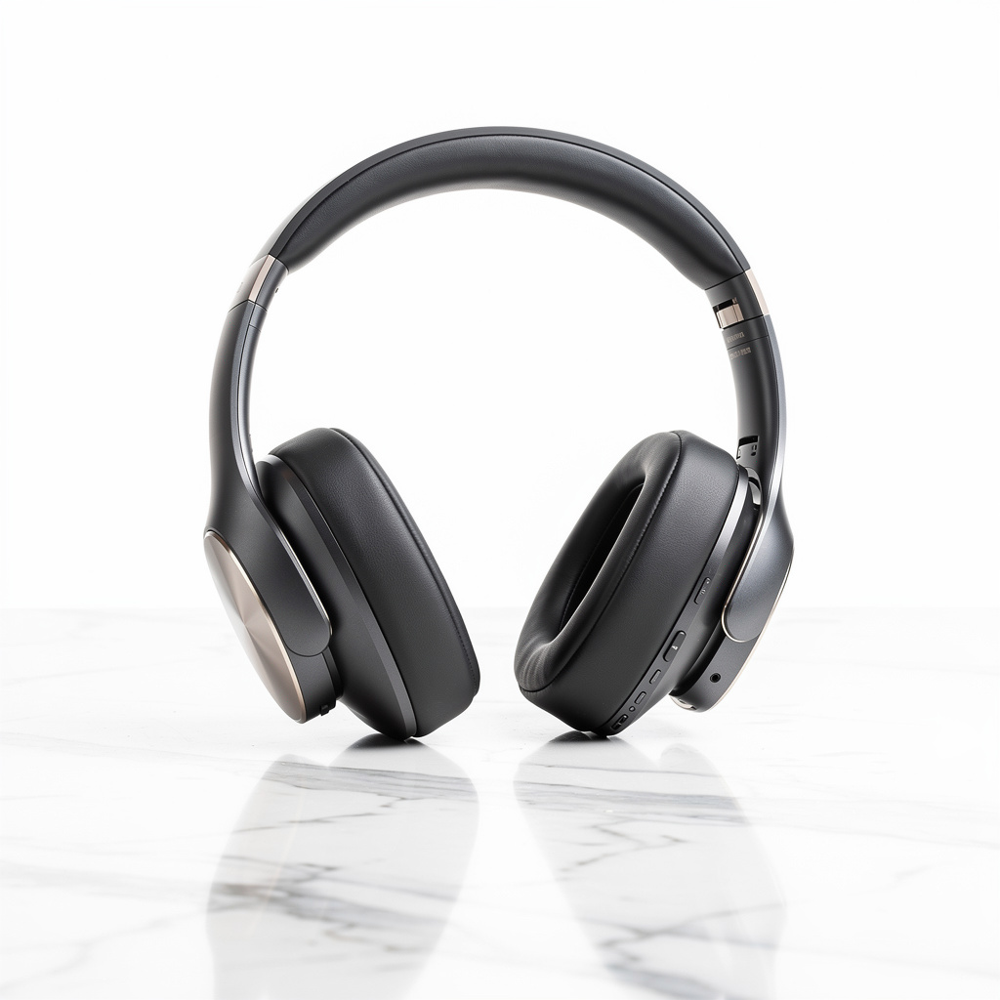
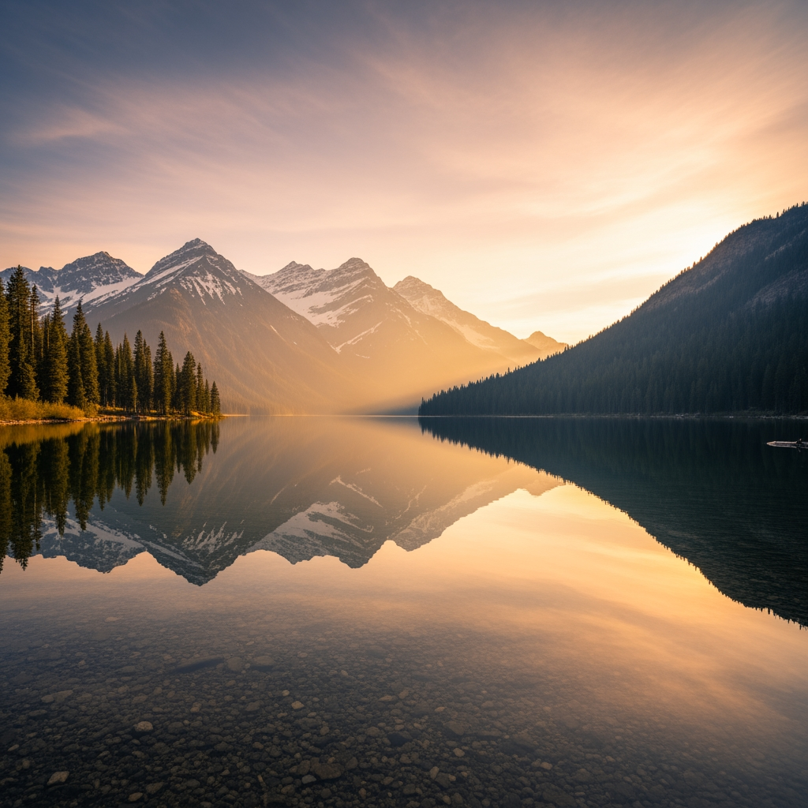
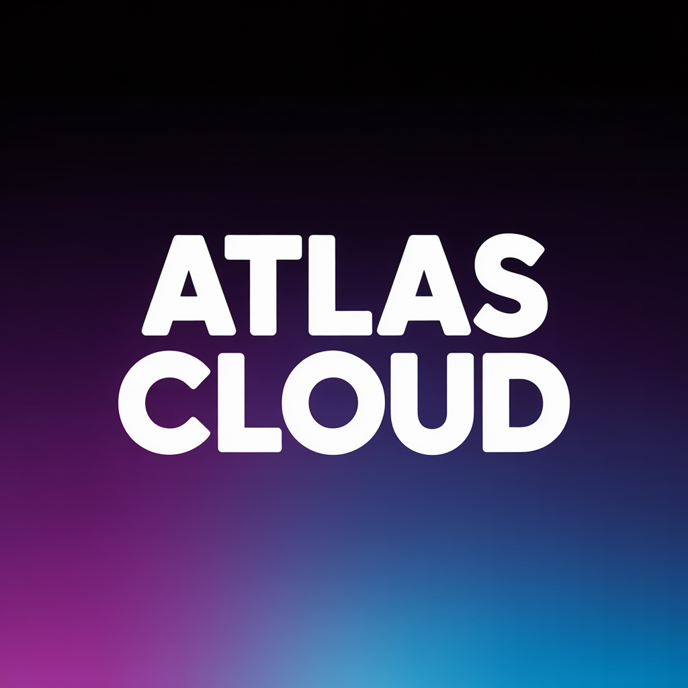

# Atlas Cloud Image Generation: Flux, Imagen & Ideogram API Guide (2026)

The AI image generation API landscape in 2026 has matured considerably. Models no longer struggle with basic composition or coherent anatomy. The real differentiators now are speed, photorealism, text rendering accuracy, and API accessibility. For developers and creative teams building products that require a programmatic AI image generation API, the question is no longer whether AI can produce usable images, but which model -- whether the Flux API, Imagen 4 API, or Ideogram API -- fits a given workflow best.

Atlas Cloud image generation provides unified API access to three of the strongest models available today: **Flux 2 Pro** via the Flux API, **Imagen 4 Ultra** via the Imagen 4 API, and **Ideogram v3** via the Ideogram API. Each occupies a distinct niche, and understanding the tradeoffs between them is essential for teams making architectural decisions around visual content pipelines. This guide covers capabilities, pricing, code examples, and practical recommendations for each model.



## Image Models at a Glance

| Feature | Flux 2 Pro | Imagen 4 Ultra | Ideogram v3 |
|---------|-----------|---------------|-------------|
| **Developer** | Black Forest Labs | Google DeepMind | Ideogram |
| **Model ID** | `black-forest-labs/flux-2-pro/text-to-image` | `google/imagen4-ultra/text-to-image` | `ideogram/ideogram-v3/text-to-image` |
| **Max Resolution** | 2048x2048 | 2048x2048 | 2048x2048 |
| **Speed** | Fast (~3s) | Medium (~8s) | Fast (~4s) |
| **Text Rendering** | Good | Good | Excellent |
| **Photorealism** | Strong | Excellent | Good |
| **Price Range** | $0.03-0.05 | $0.04-0.08 | $0.03-0.05 |
| **Best For** | Speed + versatility | Quality + realism | Typography + design |

All three models are accessible through a single Atlas Cloud API key. There is no need to manage separate accounts, billing systems, or authentication flows for each provider. Users can switch between models by changing a single parameter in their API call.

## Flux 2 Pro by Black Forest Labs

The Flux API powers Flux 2 Pro, the workhorse of the three. It generates images quickly, handles a wide range of styles competently, and offers solid text rendering capabilities. For teams that need high throughput and consistent quality across diverse prompt types, Flux 2 Pro is the pragmatic default choice.

### Key Strengths

- **Speed**: Average generation time of approximately 3 seconds at 1024x1024. This makes it viable for real-time or near-real-time applications where users are waiting for results.
- **Versatility**: Performs well across product photography, illustrations, concept art, UI mockups, and social media assets. It does not specialize narrowly, which is precisely its advantage for teams with varied content needs.
- **Text rendering**: Handles text-in-image prompts with good accuracy. Brand names, short captions, and signage are rendered legibly in most generations. While not quite at Ideogram v3's level, it is sufficient for many production use cases.
- **Consistency**: Repeated generations from similar prompts yield reliably consistent quality. This predictability matters when building automated pipelines where manual review of every output is impractical.

### Best Use Cases

- **E-commerce product imagery**: Generating product photos with clean backgrounds and studio-style lighting at scale.
- **Marketing assets**: Social media images, ad creatives, and blog illustrations where turnaround speed matters more than absolute photorealism.
- **Rapid prototyping**: UI/UX teams generating visual mockups and placeholder assets during the design phase.
- **Batch generation**: Any workflow requiring hundreds or thousands of images per day where cost-per-image and speed are the primary constraints.

### Limitations

Flux 2 Pro produces strong results, but it does not match Imagen 4 Ultra in photorealistic fidelity. Fine details like skin texture, complex reflections, and subtle lighting interactions are areas where the quality gap becomes visible. For hero images and premium visual content, teams may want to consider Imagen 4 Ultra instead.

## Imagen 4 Ultra by Google DeepMind

The Imagen 4 API gives access to Imagen 4 Ultra, Google DeepMind's flagship image generation model, and it shows. The photorealistic quality is the highest of any model currently available through a public AI image generation API. If visual fidelity is the top priority and slightly longer generation times are acceptable, Imagen 4 Ultra is the clear choice.



### Key Strengths

- **Photorealism**: This is where Imagen 4 Ultra genuinely excels. Skin textures, fabric draping, water reflections, atmospheric haze, and natural lighting are rendered with a level of detail that other models have not yet matched. In side-by-side comparisons, the difference is immediately apparent.
- **Color accuracy**: Color reproduction is notably faithful to prompt descriptions. When a prompt specifies "warm golden hour lighting," the output delivers exactly that, not an approximation.
- **Complex scenes**: Handles multi-subject compositions, intricate backgrounds, and layered depth-of-field effects with greater coherence than competing models.
- **Detail preservation at high resolution**: At 2048x2048, fine details remain sharp. There is minimal artifacting or quality degradation at the upper resolution limit.

### Best Use Cases

- **Hero images and editorial content**: Landing pages, magazine-style visuals, and any context where the image is the centerpiece and will be scrutinized closely.
- **Architectural and interior visualization**: Generating photorealistic renderings of spaces, furniture layouts, and design concepts.
- **Nature and landscape content**: Travel, tourism, and outdoor-related visuals where natural lighting and environmental detail are critical.
- **Premium brand assets**: Luxury goods, automotive, real estate, and other categories where visual quality directly correlates with perceived brand value.

### Limitations

The primary tradeoff is speed. At approximately 8 seconds per generation, Imagen 4 Ultra is roughly 2-3 times slower than Flux 2 Pro. For batch processing thousands of images, this latency adds up. The higher per-image cost also makes it less suitable for high-volume, lower-value use cases. Teams should reserve Imagen 4 Ultra for outputs where quality justifies the premium.

## Ideogram v3 by Ideogram

The Ideogram API powers Ideogram v3, which occupies a unique position in the image generation ecosystem. Its standout capability is text rendering, and it is not a marginal advantage. Ideogram v3 produces the most accurate, legible, and aesthetically integrated text-in-image results of any model currently available. For design-heavy workflows involving typography, posters, logos, and branded content, it is the specialist tool.



### Key Strengths

- **Text rendering**: This is the defining feature. Ideogram v3 handles complex typography with remarkable precision: multi-line text, varied font styles, curved text, and text integrated into scenes. Where other models frequently garble letters or produce illegible output, Ideogram v3 maintains clarity and accuracy.
- **Design composition**: Beyond text, the model demonstrates strong understanding of layout principles. Generated images exhibit balanced composition, appropriate use of negative space, and visually appealing color palettes.
- **Speed**: At approximately 4 seconds per generation, it sits comfortably between Flux 2 Pro and Imagen 4 Ultra. Fast enough for iterative workflows, with no significant latency penalty.
- **Style diversity**: Handles requests ranging from minimalist corporate design to vibrant poster art, vintage aesthetics, and modern flat design with consistent quality.

### Best Use Cases

- **Poster and banner design**: Event posters, promotional banners, and social media graphics where text is a primary element.
- **Logo concepts and branding exploration**: Generating initial logo variations and brand identity explorations during the creative process.
- **Typography-heavy content**: Quotes, motivational graphics, infographics, and any visual format where readable text is essential.
- **Marketing collateral**: Flyers, digital ads, and presentation slides where design polish and accurate text rendering both matter.

### Limitations

Ideogram v3 does not match Imagen 4 Ultra in pure photorealism. Portraits and natural scenes, while competent, lack the fine-grained detail and lighting accuracy that Imagen 4 Ultra delivers. For photographic-style content where text is not a primary element, Flux 2 Pro or Imagen 4 Ultra are stronger choices.

## Pricing Comparison

All pricing below reflects Atlas Cloud image generation API rates. No additional platform fees or subscription costs apply. When searching for the best image API, these rates are among the most competitive available.

| Model | Price per Image | $1 Free Credit Yields | Speed | Quality Tier |
|-------|----------------|----------------------|-------|-------------|
| **Flux 2 Pro** | $0.03-0.05 | ~20-30 images | ~3s | Production-ready |
| **Imagen 4 Ultra** | $0.04-0.08 | ~12-25 images | ~8s | Premium |
| **Ideogram v3** | $0.03-0.05 | ~20-30 images | ~4s | Production-ready |

Atlas Cloud provides **$1 in free credit** upon registration, which translates to approximately 20-30 images depending on the model and resolution selected. This is sufficient to evaluate all three models across multiple prompts and compare output quality before committing to a production workflow.

> [Get $1 Free Credit on Atlas Cloud](https://www.atlascloud.ai?utm_medium=article&utm_source=blog&utm_campaign=image-gen-guide)

### Cost at Scale

For teams generating images at volume, the economics become significant:

- **1,000 images/month with Flux 2 Pro**: ~$30-50
- **1,000 images/month with Imagen 4 Ultra**: ~$40-80
- **1,000 images/month with Ideogram v3**: ~$30-50
- **Mixed workflow** (500 Flux + 300 Ideogram + 200 Imagen): ~$35-55

These rates are competitive with or below the direct pricing offered by each model provider individually, with the added benefit of unified billing and a single API integration.

## How to Generate Images via Atlas Cloud API

All three models share the same AI image generation API endpoint and authentication method through Atlas Cloud image generation. The only parameter that changes between the Flux API, Imagen 4 API, and Ideogram API is the `model` field. Below are complete, working Python examples for each.

### Setup

```python
import requests

API_KEY = "your-atlas-cloud-api-key"
BASE_URL = "https://api.atlascloud.ai/api/v1"
HEADERS = {
    "Authorization": f"Bearer {API_KEY}",
    "Content-Type": "application/json"
}
```

### Flux 2 Pro: Fast, Versatile Generation

```python
# Flux 2 Pro - Fast, versatile
flux_response = requests.post(
    f"{BASE_URL}/model/generateImage",
    headers=HEADERS,
    json={
        "model": "black-forest-labs/flux-2-pro/text-to-image",
        "prompt": "Professional product photo of wireless headphones on marble surface, studio lighting",
        "width": 1024,
        "height": 1024
    }
)

result = flux_response.json()
print(f"Image URL: {result['output']['image_url']}")
```

### Imagen 4 Ultra: Maximum Quality

```python
# Imagen 4 Ultra - Highest quality
imagen_response = requests.post(
    f"{BASE_URL}/model/generateImage",
    headers=HEADERS,
    json={
        "model": "google/imagen4-ultra/text-to-image",
        "prompt": "Photorealistic aerial view of a Norwegian fjord at golden hour, 8K quality",
        "width": 1024,
        "height": 1024
    }
)

result = imagen_response.json()
print(f"Image URL: {result['output']['image_url']}")
```

### Ideogram v3: Typography and Design

```python
# Ideogram v3 - Best text rendering
ideogram_response = requests.post(
    f"{BASE_URL}/model/generateImage",
    headers=HEADERS,
    json={
        "model": "ideogram/ideogram-v3/text-to-image",
        "prompt": "Modern poster design with text 'ATLAS CLOUD' in bold typography, gradient background",
        "width": 1024,
        "height": 1024
    }
)

result = ideogram_response.json()
print(f"Image URL: {result['output']['image_url']}")
```

### Polling for Results

For models that process asynchronously, use the prediction endpoint to check status:

```python
import time

request_id = result["request_id"]

while True:
    status = requests.get(
        f"{BASE_URL}/model/prediction/{request_id}/get",
        headers={"Authorization": f"Bearer {API_KEY}"}
    ).json()

    if status["status"] == "completed":
        print(f"Image URL: {status['output']['image_url']}")
        break
    elif status["status"] == "failed":
        print(f"Generation failed: {status.get('error', 'Unknown error')}")
        break

    time.sleep(2)
```

Users can also test all three models interactively through the [Atlas Cloud Playground](https://www.atlascloud.ai/playground?utm_medium=article&utm_source=blog&utm_campaign=image-gen-guide) before writing any code.

## Which Model Should Teams Choose?

Choosing the best image API depends on the specific requirements of the project. Here is a practical decision framework.

**Choose Flux 2 Pro if:**

- Speed is the top priority and images need to be generated in under 5 seconds.
- The workflow involves high-volume batch generation where cost-per-image matters most.
- The content spans multiple visual styles and no single specialty dominates.
- The application requires near-real-time image generation for user-facing features.

**Choose Imagen 4 Ultra if:**

- Photorealistic quality is the primary requirement and the image will be scrutinized closely.
- The content involves nature, architecture, portraits, or any subject where lighting and texture detail are critical.
- The brand or product demands premium visual quality and the per-image cost is justified.
- Generation speed of 8 seconds is acceptable for the given use case.

**Choose Ideogram v3 if:**

- The image must contain readable, accurate text, whether logos, captions, titles, or signage.
- The project is design-centric, involving posters, banners, infographics, or brand materials.
- Typography quality is a non-negotiable requirement that other models cannot reliably deliver.
- The workflow blends visual design with textual elements in a single image.

**Use multiple models if:**

- Different content types within the same project have different quality requirements. Many teams use the Flux API for bulk content, the Imagen 4 API for hero visuals, and the Ideogram API for anything involving text. Atlas Cloud image generation makes switching between models trivial through the best image API platform available.

## Frequently Asked Questions

### Do I need separate API keys for each model?

No. A single Atlas Cloud API key provides access to all three image generation models, plus over 300 other AI models including video generation (Seedance 2.0, Sora 2, Kling 3.0, Veo 3.1), language models, and more. There is no need to manage multiple provider accounts.

### What resolution should I use?

For most web and social media use cases, 1024x1024 offers the best balance of quality and cost. For print-quality or large-format display, 2048x2048 is available across all three models. Higher resolutions increase generation time and cost proportionally.

### How does the $1 free credit work?

Upon [creating an Atlas Cloud account](https://www.atlascloud.ai?utm_medium=article&utm_source=blog&utm_campaign=image-gen-guide), users receive $1 in free credit automatically. This credit can be used across any model on the platform. For image generation specifically, $1 is enough to generate approximately 20-30 images, providing ample room to evaluate all three models.

### Can I use generated images commercially?

Commercial usage rights depend on the specific model's license terms. Atlas Cloud does not impose additional restrictions beyond those set by the model providers. Users should review the respective usage policies for Flux 2 Pro, Imagen 4 Ultra, and Ideogram v3 for their specific commercial use case.

### What aspect ratios are supported?

All three models support custom width and height parameters. Common configurations include 1024x1024 (1:1), 1024x768 (4:3), 768x1024 (3:4), 1024x576 (16:9), and 576x1024 (9:16). The maximum resolution of 2048x2048 applies to any aspect ratio within that pixel budget.

### How do these models compare to DALL-E and Midjourney?

Flux 2 Pro, Imagen 4 Ultra, and Ideogram v3 represent the current state of the art in API-accessible image generation. Unlike Midjourney, which operates primarily through a Discord interface, all three models are available through a standard REST API, making them suitable for automated workflows and product integrations. Compared to DALL-E 3, the models available on Atlas Cloud generally offer higher resolution, faster generation, and more competitive pricing.

## Get Started

Atlas Cloud image generation provides two paths for getting started with the AI image generation API:

- **[Playground](https://www.atlascloud.ai/playground?utm_medium=article&utm_source=blog&utm_campaign=image-gen-guide)**: Test all three models interactively in the browser. No code required. Useful for prompt experimentation and quality comparison before committing to a specific model.
- **[API Access](https://www.atlascloud.ai?utm_medium=article&utm_source=blog&utm_campaign=image-gen-guide)**: Sign up, grab an API key, and start generating images programmatically. The $1 free credit applies immediately, and there are no minimum commitments or subscription requirements.

> [Try Atlas Cloud Image Generation — $1 Free Credit](https://www.atlascloud.ai?utm_medium=article&utm_source=blog&utm_campaign=image-gen-guide)

---

## Related Articles

- [Seedance 2.0 Pricing Breakdown](/blog/seedance-2-0-pricing-breakdown?utm_medium=article&utm_source=blog&utm_campaign=image-gen-guide)
- [Kling 3.0 Review: Features, Pricing & How to Access](/blog/kling-3-0-review?utm_medium=article&utm_source=blog&utm_campaign=image-gen-guide)
- [Generate 100 Marketing Videos/Week Under $50](/blog/generate-100-videos-week-atlas-cloud?utm_medium=article&utm_source=blog&utm_campaign=image-gen-guide)
- [Sora 2 on Atlas Cloud: Complete API Guide](/blog/sora-2-api-guide?utm_medium=article&utm_source=blog&utm_campaign=image-gen-guide)
- [Veo 3.1 on Atlas Cloud: Google's 4K AI Video Guide](/blog/veo-3-1-api-guide?utm_medium=article&utm_source=blog&utm_campaign=image-gen-guide)
